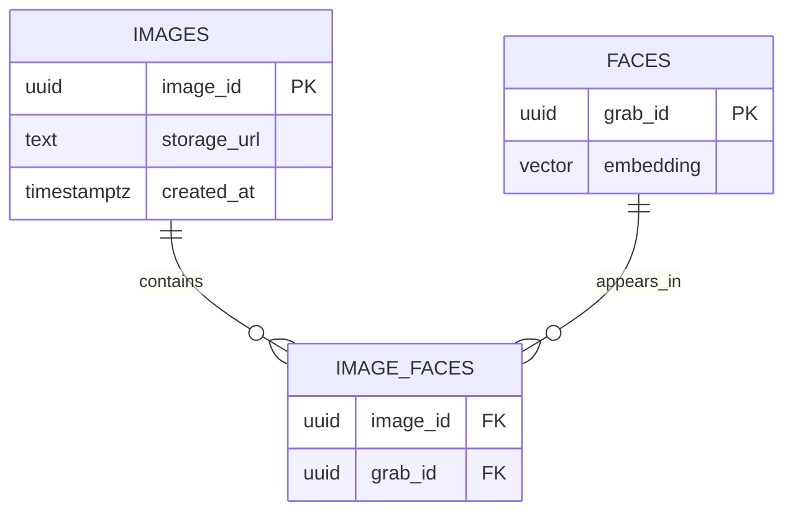

# GRABPIC: Intelligent Identity and Retrieval Engine

GRABPIC is a high-performance biometric identification and image retrieval system. It utilizes the FaceNet model for facial feature extraction and leveraging the pgvector extension within Supabase for efficient vector similarity searches using HNSW indexing.

## Architecture and Engineering Decisions

### Postgres RPC for Vector Mathematics
The system utilizes a PostgreSQL Stored Procedure (`match_face` RPC) to execute cosine similarity calculations directly within the database layer. This architectural choice minimizes network latency by avoiding the transfer of large vector payloads and leverages the native binary execution speed of the PostgreSQL engine.

### Event-Loop Concurrency Safety
The FastAPI endpoints are implemented using standard `def` instead of `async def`. Given that the DeepFace inference engine and the Supabase-py client are synchronous and blocking operations, executing them within an asynchronous context would stall the ASGI event loop. By utilizing standard definitions, FastAPI automatically delegates these tasks to an external thread pool, ensuring the server remains responsive to concurrent requests.

### Ingestion Deduplication
The `/ingest` endpoint executes a biometric identity check against existing records prior to insertion. If a detected face matches an existing identity within the defined similarity threshold (0.5), the system reuses the existing `grab_id`. This implementation ensures that multiple photographs containing the same individual are unified under a single biometric key.

## Technical Specifications

- **Backend Framework**: FastAPI
- **Machine Learning**: DeepFace (FaceNet)
- **Database**: Supabase (PostgreSQL + pgvector)
- **Search Algorithm**: HNSW (Hierarchical Navigable Small World)
- **Vector Dimension**: 128

## Initial Setup SOP

### 1. Environment Configuration
Establish a Python virtual environment and install the necessary dependencies:

```powershell
python -m venv venv
.\venv\Scripts\Activate.ps1
pip install -r requirements.txt
```

### 2. Database Initialization
Execute the `setup.sql` script within the Supabase SQL Editor to initialize the necessary extensions, tables, and RPC functions.

### 3. Environment Variables
Configure a `.env` file in the root directory with the following credentials:

```env
SUPABASE_URL=your_project_url
SUPABASE_KEY=your_service_role_key
```

### 4. Pre-Flight: Download Model Weights
Execute the following command to pre-cache the FaceNet weights and prevent initialization latency during the first API request:

```powershell
python -c "from deepface import DeepFace; DeepFace.represent('grabpic/test_images/ben.jpeg', model_name='Facenet', enforce_detection=False)"
```

### 5. Application Execution
Start the server using Uvicorn:

```powershell
uvicorn grabpic.main:app --reload
```

## API Documentation and Exploration

### Integrated Swagger UI
FastAPI provides an interactive OpenAPI documentation interface for real-time testing and exploration:
- **Swagger URL**: `http://localhost:8000/docs`
- **Alternative Redoc**: `http://localhost:8000/redoc`

### Core Endpoints
- `POST /ingest`: Processes raw image data to extract biometric features and map them to identities.
- `POST /auth`: Executes a one-to-many similarity search to identify the user from a provided facial token.
- `GET /images/{grab_id}`: Retrieves the collection of image storage URLs associated with a specific biometric key.

## Automated Quality Assurance

The system includes a suite of automated tests to ensure endpoint stability and error-handling integrity.

### Running Tests
```powershell
pytest grabpic/tests/test_main.py
```

## Relational Persistence Schema

The following diagram illustrates the many-to-many relationship between photographic data and discovered biometric identities:



## Manual Verification (CURL Examples)

Execute these commands from the root directory to verify endpoint functionality.

### 1. Image Ingestion
```powershell
curl -X POST "http://localhost:8000/ingest" `
     -H "accept: application/json" `
     -H "Content-Type: multipart/form-data" `
     -F "file=@grabpic/test_images/ben.jpeg"
```

### 2. Biometric Authentication
```powershell
curl -X POST "http://localhost:8000/auth" `
     -H "accept: application/json" `
     -H "Content-Type: multipart/form-data" `
     -F "file=@grabpic/test_images/ben.jpeg"
```

### 3. Data Retrieval
```powershell
curl -X GET "http://localhost:8000/images/{grab_id}" `
     -H "accept: application/json"
```
